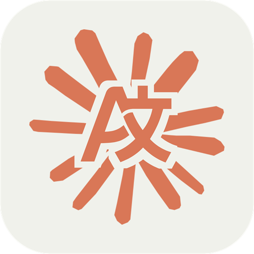
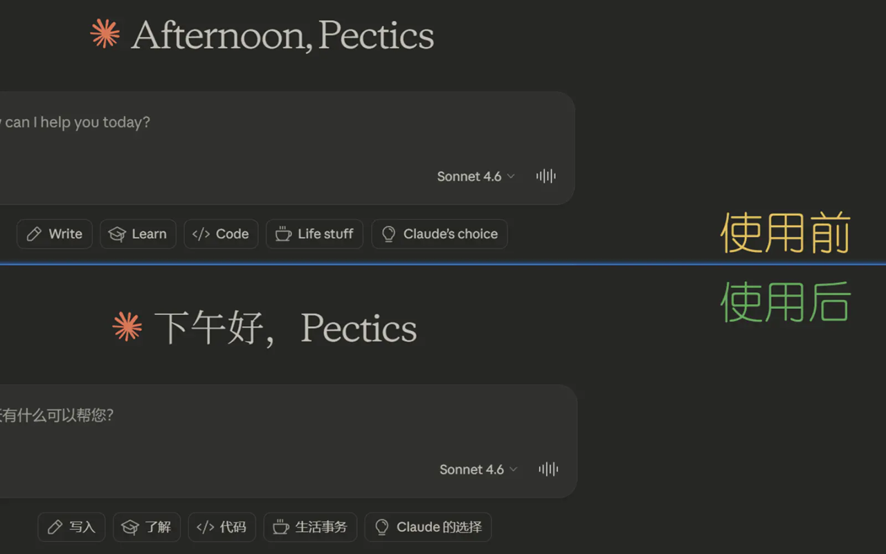
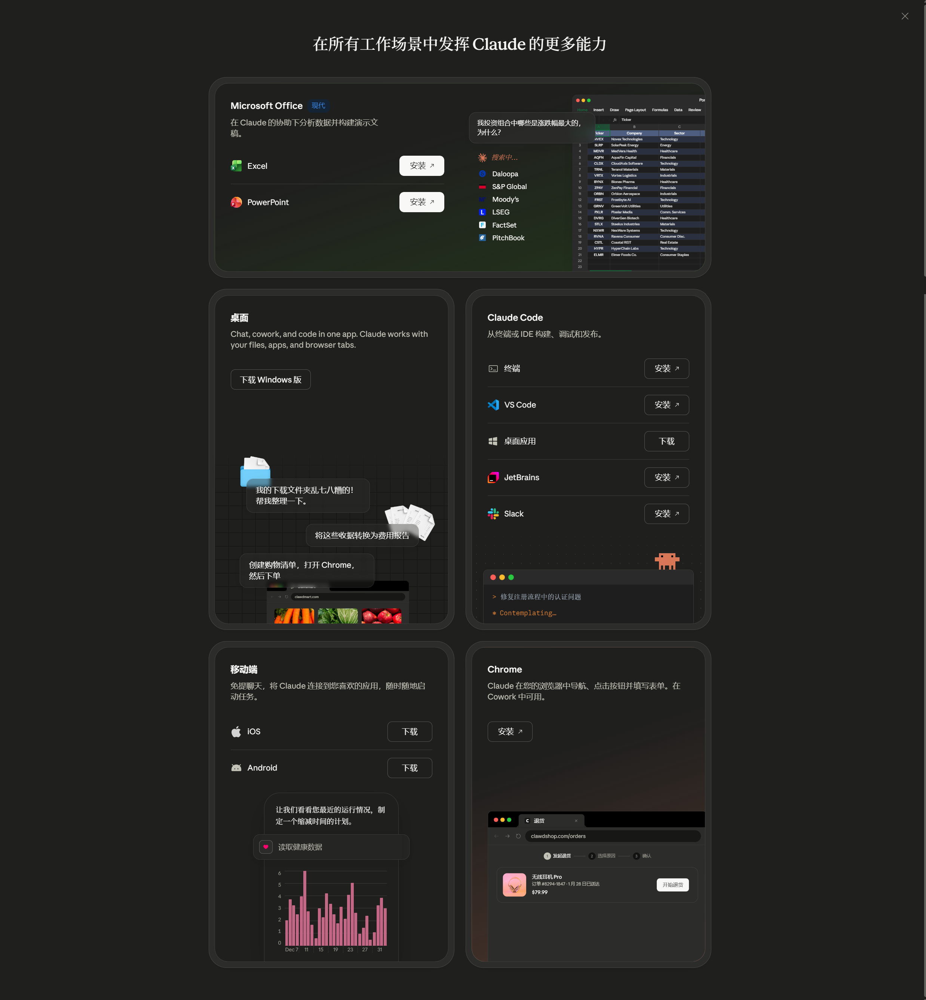
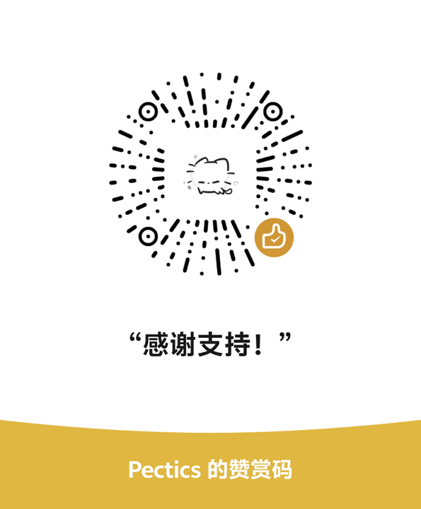

<div align="center">



# Claude i18n

**给 Claude.ai 加上一个并不存在的语言。**

简体中文 | [繁體中文](README.tw.md) | [English](README.en.md)

[](https://github.com/pectics/claude-web-i18n/releases)
[](LICENSE)
[](#安装)
[](#支持的语言)

</div>

---

## 它能做什么？

Claude 官方至今不支持简体中文界面。**这个扩展解决了这个问题。**

安装后，Claude Web 的语言菜单里会出现 **简体中文** 选项。点一下，近万条 UI 文本瞬间切换为中文。不需要代理，不需要配置，不需要等 Anthropic 哪天心情好了才支持。

<div align="center">





</div>

---

## 安装

### 方式一：从 Releases 下载（推荐）

> ⚡ 30 秒搞定，无需任何技术知识

1. 前往 [Releases 页面](https://github.com/pectics/claude-web-i18n/releases)，下载最新版本的 `.crx` 文件
2. 打开 Chrome / Edge，进入 `chrome://extensions/`
3. 打开右上角的 **开发者模式**
4. 将下载的 `.crx` 文件**直接拖进**浏览器窗口
5. 点击「添加扩展程序」确认安装
6. 打开 [claude.ai](https://claude.ai)，点击左下角用户名 → 语言 → **简体中文** ✓

### 方式二：从源码构建

```bash
git clone https://github.com/pectics/claude-web-i18n.git
cd claude-web-i18n
```

然后在 `chrome://extensions/` 中打开**开发者模式**，选择「加载已解压的扩展程序」，选择项目的 `extension/` 目录。

### 方式三：应用商店安装

- Chrome Web Store：
  [Claude i18n](https://chromewebstore.google.com/detail/claude-i18n/fkfmbjccelbeolkoekeaegajhhdndajj)
- Microsoft Edge Add-ons：
  [Claude i18n](https://microsoftedge.microsoft.com/addons/detail/claude-i18n/meogggfdmdeigjpkcpkdhngaegpncgjc)

---

## 它是怎么工作的？

Claude 的后端接口拒绝 `zh-CN` 这个 locale 值（会直接返回验证错误）。所以这个扩展没有去碰后端——它在浏览器端拦截了所有语言包请求，把它们替换成托管在 Vercel 上的中文资源。

```
你点击「简体中文」
        ↓
扩展注入自定义菜单项（与原生菜单外观一致）
        ↓
Claude 发出 /i18n/*.json 请求
        ↓
扩展在页面层拦截请求（无感知）
        ↓
返回 9951 条精心翻译的中文文本
        ↓
UI 全面切换为中文，无需刷新
```

**智能缓存：** 语言包在本地双重缓存（Cache Storage + chrome.storage.local），配合版本哈希校验。第一次加载后，后续切换几乎瞬间完成，且在版本没有更新时完全不发出网络请求。

---

## 支持的语言

| 语言 | 翻译条目 | 状态 |
|------|----------|------|
| 简体中文 (zh-CN) | 9,951 条 | ✅ 可用 |
| 更多语言 | — | 欢迎贡献 |

---

## 参与贡献

### 改进翻译

翻译文件位于 [`zh-CN/zh-CN.json`](zh-CN/zh-CN.json)。原文对照在 [`.original/en-US.json`](.original/en-US.json)。

直接编辑 JSON 文件提 PR 即可，结构非常简单：

```json
{
  "some.ui.key": "对应的中文翻译"
}
```

### 添加新语言

1. 在 [`locales.json`](locales.json) 中添加新 locale 条目（如 `{"locale": "zh-TW", "name": "繁體中文 (台灣)"}`)
2. 创建对应目录和翻译文件（参考 `zh-CN/` 的结构）
3. 提交 PR

### 本地构建

```bash
# 构建 Vercel 部署用的语言包分发文件
./build.sh

# 打包浏览器扩展 zip
./package-extension-zip.sh
```

---

## 更新日志

### 1.0.2

- 跟进 Claude Web 最近的前端逻辑更新，恢复自定义语言切换能力
- 调整 page hook 注入方式，避免 runtime i18n store 因时序问题捕获失败
- 兼容新版 `gated-messages` 请求链路，防止切换到扩展语言时被 404 HTML 响应中断
- 增加坏缓存自清理逻辑，旧的无效 HTML 响应不会再长期污染语言包缓存

### 1.0.1

- 前端逆向成功，打通 Claude Web 运行时语言覆盖入口
- 语言切换变为无刷新即时生效，整体体验明显更顺滑
- 菜单注入、运行时切换、语言包拦截与本地缓存链路正式闭环

### 1.0.0

- 初始 MVP 版本发布
- 在 Claude Web 语言菜单中注入简体中文入口
- 提供基础中文语言包分发、请求拦截与浏览器端加载能力

---

## 常见问题

**切换语言后没有效果？** \
确认扩展已启用，然后刷新 claude.ai 页面。

**会影响我的 Claude 账号吗？** \
不会。扩展只在浏览器端工作，不修改任何账号设置或与 Anthropic 服务器交互（除了正常的语言包拉取）。

**切换回英文还能正常用吗？** \
完全没问题。在语言菜单选择任意官方支持的语言，扩展会自动退出中文模式。

**语言包会自动更新吗？** \
会。扩展通过版本哈希检测远端更新，有新版本时自动下拉最新语言包。

---

## 许可证

[MIT](LICENSE) © 2026 [Pectics](https://github.com/Pectics)

---

<div align="center">

如果这个扩展帮到了你，可以请我喝杯咖啡 ☕ \
或者……点个 ⭐，也是莫大的支持。

[![爱发电](https://img.shields.io/badge/爱发电-Pectics-946ce6?style=flat-square&logo=data:image/svg+xml;base64,PHN2ZyB3aWR0aD0iMTAwIiBoZWlnaHQ9IjEwMCIgdmlld0JveD0iMTUgMjUgMTMwIDExMCIgeG1sbnM9Imh0dHA6Ly93d3cudzMub3JnLzIwMDAvc3ZnIj48cGF0aCBmaWxsLXJ1bGU9ImV2ZW5vZGQiIGNsaXAtcnVsZT0iZXZlbm9kZCIgZD0iTTY1IDkwLjdjLTEuNiAwLTIuOCAxLjMtMi44IDIuOCAwIDEuNiAxLjMgMi44IDIuOCAyLjhzMi44LTEuMyAyLjgtMi44YzAtMS42LTEuMy0yLjgtMi44LTIuOFoiIGZpbGw9IndoaXRlIi8+PHBhdGggZmlsbC1ydWxlPSJldmVub2RkIiBjbGlwLXJ1bGU9ImV2ZW5vZGQiIGQ9Ik05MS44IDk5LjJjMS42IDAgMi44IDEuMyAyLjggMi44IDAgMS42LTEuMyAyLjgtMi44IDIuOC0xLjYgMC0yLjgtMS4zLTIuOC0yLjggMC0xLjYgMS4zLTIuOCAyLjgtMi44WiIgZmlsbD0id2hpdGUiLz48cGF0aCBmaWxsLXJ1bGU9ImV2ZW5vZGQiIGNsaXAtcnVsZT0iZXZlbm9kZCIgZD0iTTEzNC42IDk4LjRjMi41IDEuNSA2LjUgNC4xIDUuMSA4LjctLjUgMS43LTEuNyAzLjEtMy40IDQtMCAwLS4xLjEtLjEuMS0yLjIgMS4xLTUuMSAxLjItNy43LjMtLjgtLjMtMS42LS41LTIuNS0uOC0uNi0uMi0xLjItLjQtMS44LS42LTEuOSAzLjEtNS44IDYuNS0xMS4zIDkuNC05LjkgNS4yLTI0LjggOC42LTQyIDQuOC0xMy4yLTIuOS0yMS45LTguMy0yNS44LTE2LTMuMS02LjEtMi40LTEyLjMtLjgtMTYuMSAxLjUtMy4xIDUuNy03LjEgMTAuOS0xMS4zLTEuMy0xLjUtMi41LTMuNC0yLjQtNS4zIDAtMS42LjgtMi45IDIuMi0zLjggMy41LTIuNCA4LjItLjUgMTEuMSAxLjIgMS43LTEuMSAzLjMtMi4zIDQuOS0zLjMtMS4xLS40LTIuNy0uOC00LjctMS03LS43LTI1LjMtNC0zMS43LTYuOEMxOC45IDU1LjMgMTkuMSA0Ny44IDIwLjcgNDMuOWMyLjgtNi45IDE4LjEtMTEgMjUuMS0xMC44IDMuNC4xIDUuNCAxLjEgNi4xIDMuMSAxLjMgMy40LTIuNiA1LjMtNy43IDcuNy0xLjMuNi0yLjggMS40LTQuMyAyLjEgNy4xLjYgMTcuNy4yIDI1LjYtLjEgNi44LS4zIDEzLjItLjUgMTguNy0uNCAxOS4xLjQgMzQuMiA4LjQgNDQuNiAyMy43IDYuOCAxMCA0LjggMjAuMSAxLjcgMjcuOSAxLjQuMSAyLjcuNSA0IDEuNFpNNjEgNzYuNmMtMS4xLS40LTIuMi0uNi0yLjgtLjUuMi40LjcgMSAxLjIgMS42LjUtLjQgMS0uOCAxLjYtMS4yWm03Mi44IDI5LjhjLjUtLjMuNy0uNS44LS45LjItLjYtLjctMS4zLTIuNi0yLjQtMS40LS45LTIuOS0xLTUuMi0uNi0uMSAwLS4yIDAtLjMgMC0uMSAwLS4xIDAtLjIgMC0zLjUuMy02LjItMi45LTYuOC0zLjYtLjktMS4yLS43LTIuOC40LTMuOCAxLjEtLjkgMi44LS43IDMuOC40LjMuNC44LjggMS4yIDEuMSAzLjQtNy40IDUuNS0xNS45LS40LTI0LjUtOS42LTE0LjEtMjIuOC0yMS00MC40LTIxLjQtNS4zLS4xLTExLjcuMS0xOC40LjQtMTUuNi42LTI2LjcuOS0zMi45LTEuMS0uMS0wLS4xLS4xLS4yLS4xLTEuOC0uNi0zLjItMS4zLTQuMi0yLjMtMS0xLjEtMS0yLjguMS0zLjggMS4xLTEuMSAyLjgtMSAzLjguMS4xLjEuMy4yLjUuMyAyLjQtMi4xIDUuOS0zLjggOS4xLTUuNC4zLS4yLjctLjMgMS4xLS41LTIuNy4zLTYuMyAxLjEtMTAgMi41LTQuNyAxLjgtNi45IDMuNy03LjMgNC45LTIgNSA3IDkuNSAxMSAxMS4yIDUuNSAyLjQgMjIuNyA1LjYgMzAuMSA2LjQgNC43LjUgNy42IDEuOSA5LjMgMyA1LTMuMiA4LjktNS41IDEwLjEtNi4yIDEuMi0uOCAyLjktLjMgMy42LjlzLjMgMi45LS45IDMuN2MtMTQuMyA4LjQtMzYuNyAyMy4zLTM5LjggMjkuNy0xLjEgMi41LTEuNiA3IC43IDExLjUgMy4xIDYuMSAxMC44IDEwLjcgMjIuMiAxMy4yIDI1LjMgNS41IDQzLjItNS43IDQ3LjMtMTEuNC0uNC0uMy0uOC0uNy0xLjEtMS0uOS0xLjItLjctMi45LjUtMy43IDEuMi0uOSAyLjktLjcgMy43LjUuNS43IDMuNCAxLjUgNSAyIC45LjMgMS44LjYgMi43LjkgMS4zLjQgMi42LjQgMy42LS4xWiIgZmlsbD0id2hpdGUiLz48L3N2Zz4=)](https://afdian.com/a/pectics)
[](https://paypal.me/Pectics)

| 微信赞赏 | 支付宝 |
|:---:|:---:|
|  |  |
</div>
